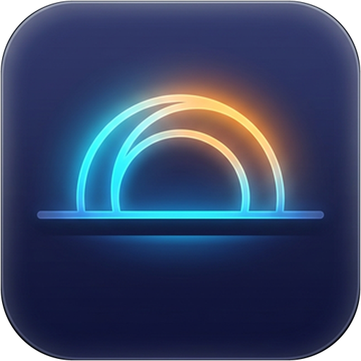
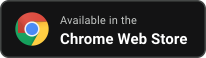
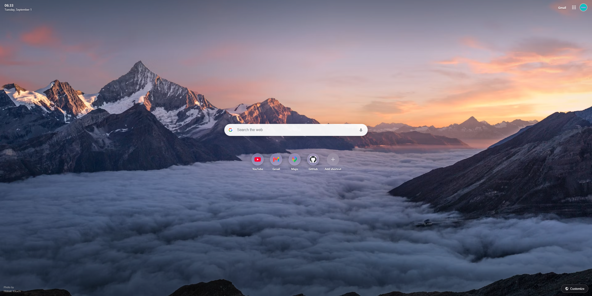
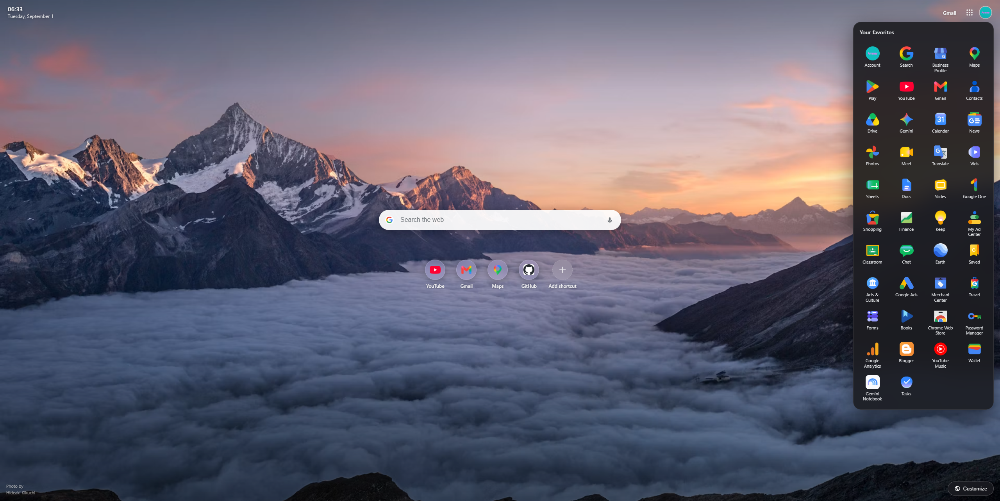
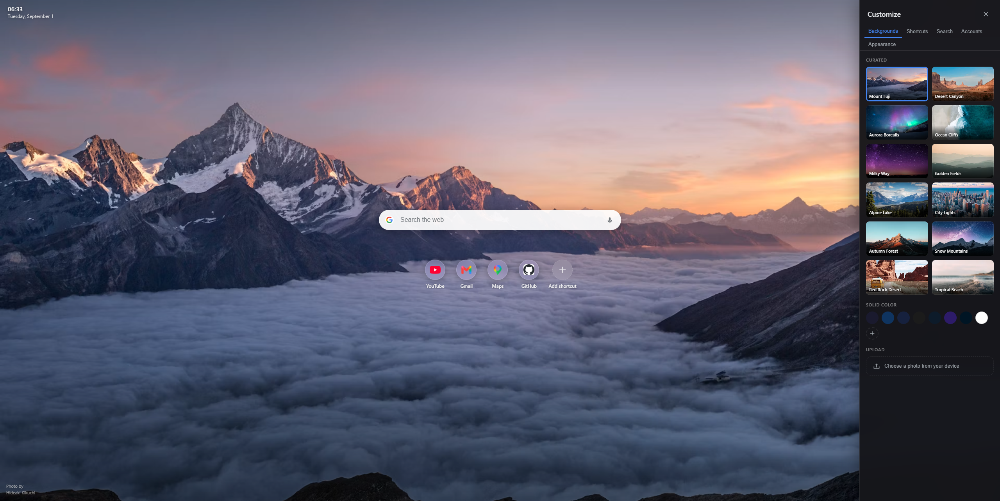
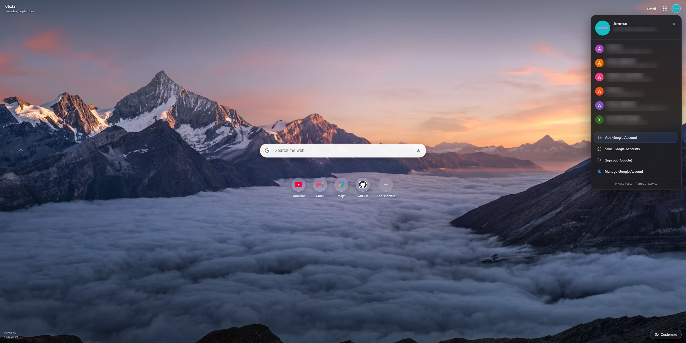
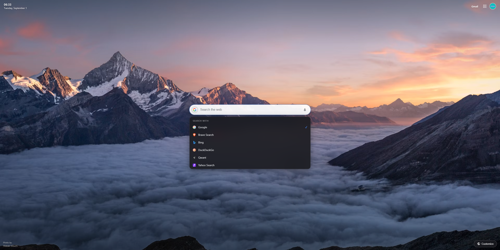

# Horizon: Modern New Tab

<p align="center">
  
</p>

<p align="center">
  <a href="https://chromewebstore.google.com/detail/horizon-modern-new-tab/lcmbbnjaajbpdjadlcipfnoghfmlgdhd"></a>
</p>

<p align="center">
  <a href="https://chromewebstore.google.com/detail/horizon-modern-new-tab/lcmbbnjaajbpdjadlcipfnoghfmlgdhd"></a> <a href="LICENSE"></a>
</p>

<p align="center">
  A clean, elegant dashboard designed to help you stay organized, focused, and inspired every time you open a tab.<br>
  Brings your Google accounts, 42 bundled Google apps, multi-engine search, and custom wallpapers into one modern workspace with 100% local privacy.
</p>

<p align="center">
  🌐 <a href="https://horizon.jeddah.dev"><strong>horizon.jeddah.dev</strong></a> &nbsp;&bull;&nbsp; 💬 <a href="https://horizon.jeddah.dev/#support"><strong>Support Form</strong></a> &nbsp;&bull;&nbsp; 🔒 <a href="PRIVACY.md"><strong>Privacy Policy</strong></a>
</p>

---

## Key Highlights

- **Fast Google Account Switching:** Auto-detects active Google sessions (`/u/0`, `/u/1`, etc.) to launch apps directly in your chosen profile.
- **Complete Google Apps Drawer:** Neatly organized menu with 42 bundled Google apps and drag-and-drop custom ordering.
- **Multi-Engine Search:** Switch seamlessly between Google, Brave Search, Bing, DuckDuckGo, Qwant, and Yahoo with instant keyboard shortcuts, auto-complete suggestions, and voice dictation.
- **Customizable Shortcuts:** Keep your daily websites organized in a clean row or 2-column grid with automated high-resolution favicons.
- **Curated & Custom Backgrounds:** Choose from curated high-resolution nature photography, minimalist solid colors and gradients, or upload your own photo.
- **Frosted Glass Appearance:** Dark Obsidian and Light Frost themes that adapt to your system appearance with adaptive contrast text.
- **Privacy-First Architecture:** 100% local storage via `chrome.storage.local`. Zero analytics, zero telemetry, no tracking, and no external servers.

---

## Preview

<p align="center">
  
</p>

<p align="center">
  
  
</p>

<p align="center">
  
  
</p>

---

## Installation

### Option 1: Chrome Web Store (Recommended)

Install directly from the official store listing:
👉 **[Get Horizon on the Chrome Web Store](https://chromewebstore.google.com/detail/horizon-modern-new-tab/lcmbbnjaajbpdjadlcipfnoghfmlgdhd)**

### Option 2: Load Unpacked (Developer Mode)

1. Clone or download this repository:
   ```bash
   git clone https://github.com/iammarxg/horizon.git
   ```
2. Open your browser's extension management page:
   - **Chrome:** `chrome://extensions/`
   - **Brave:** `brave://extensions/`
   - **Edge:** `edge://extensions/`
3. Enable **Developer mode** using the toggle in the top-right corner.
4. Click **Load unpacked** and select the `extension/` folder inside the cloned repository.
5. Open a new tab (`Ctrl + T`) to start using Horizon.

---

## Support & Feedback

Have a question, bug report, or feature request? We would love to hear from you:

- **Official Support Form:** [horizon.jeddah.dev/#support](https://horizon.jeddah.dev/#support)
- **Public Issue Tracker:** [GitHub Issues](https://github.com/iammarxg/horizon/issues)

---

## Building Releases

To package the extension into a production-ready ZIP archive for publishing:

```bash
python scripts/package.py
```

The packaged archive will be saved in the `releases/` directory.

---

## License

This project is licensed under the [GNU Affero General Public License v3.0 (AGPLv3)](LICENSE).
